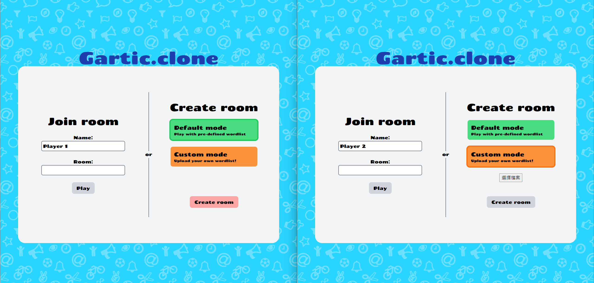
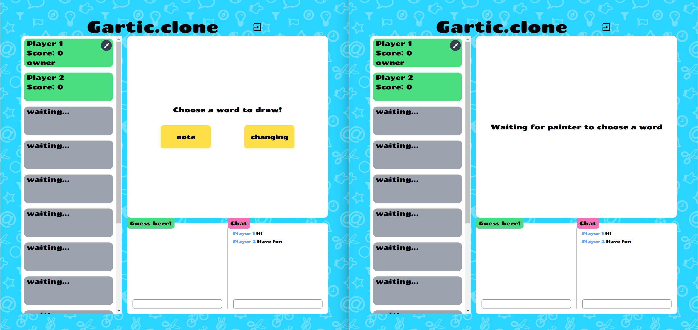
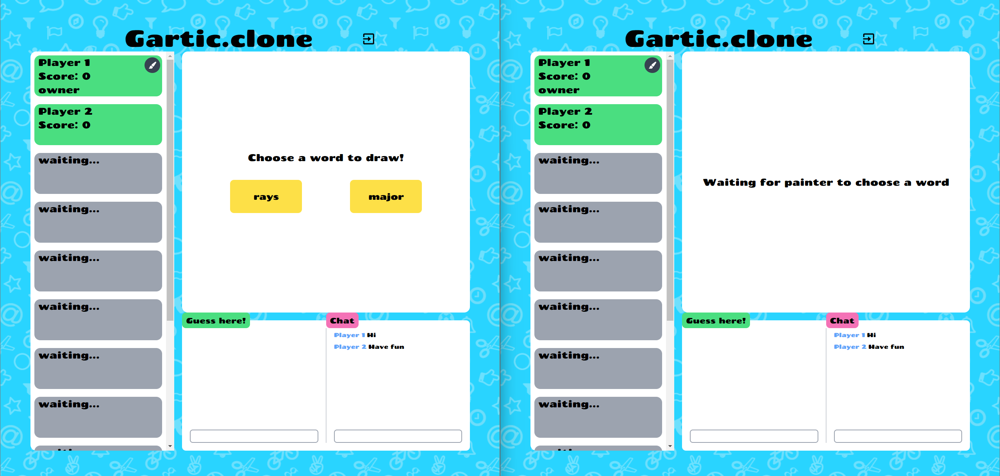
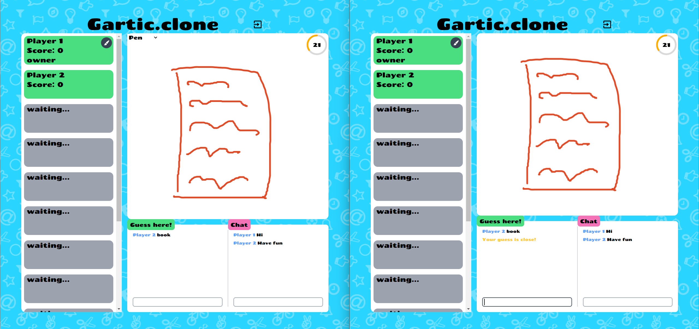
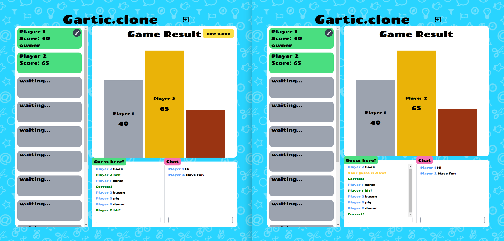

# Gartic Clone

This is a Gartic clone project built with React, Node.js, Express, and Socket.IO.

## Project Description

The Gartic clone is a multiplayer drawing and guessing game where players take turns drawing an assigned word while others try to guess what it is. The project utilizes web sockets through Socket.IO to enable real-time communication between players.

### Features

- Multiplayer functionality: Players can join a shared drawing room and interact with each other in real-time.
- Drawing and guessing: Players take turns drawing and guessing the assigned word.
- Chat functionality: Players can communicate with each other through a chat feature.
- Score tracking: The game keeps track of scores for each player throughout the session.
- Custom wordlist: Players can upload their own wordlists.

## Technologies Used

- React: A JavaScript library for building user interfaces.
- Node.js: A JavaScript runtime environment for server-side applications.
- Express: A web application framework for Node.js.
- Socket.IO: A library that enables real-time, bidirectional communication between web clients and servers.
- Tailwind css: A utility-first CSS framework for building modern and responsive user interfaces.

## Screenshots

# Lobby

# Waiting room

# Painter choosing a word

# Drawing and guessing

# Ending

